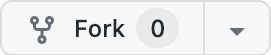

# Lab: Containerizing a React Application

## Learning Objectives
- Create a Docker image of a React application
- Run the Docker image locally
- Interact with a running Docker container
- Understand Docker container isolation

## Fork and Clone the Reference Application
Let' start by forking the reference application repository. This will create a copy that you can modify and use without affecting the original codebase. Cloning will then brings this copy to your local machine.

1. **Fork the Repository:** Navigate to the [reference application](https://github.com/open-devsecops/topic-2-lab-reference-app) and fork the repository to your own GitHub account.

 

2. **Clone Your Fork:** Open your terminal and clone the forked repository to your local machine using `git clone <your-fork-url>`.

## Run the React Application Locally
**Navigate to the Project Directory:** Move into the project directory in your terminal.

**Install Dependencies:** Run `npm install` to install the required node modules for the project.

**Start the Application:** Enter `npm start` to run the application locally. Your default web browser should automatically open to `http://localhost:3000`, displaying the reference application.

## Step 3: Containerize the Application

